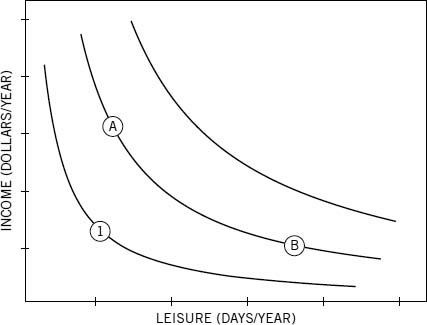

<!-- This style returns the shading to code chunks where verbatim=TRUE -->
<style>
pre:not([r]) {background-color:#F5F5F5;}
</style>

```{r print_verbatim, echo=FALSE, messages=FALSE, eval=FALSE}
## This will add a 'hook' for verbatim=TRUE
## Thanks to https://ramnathv.github.io/posts/verbatim-chunks-knitr/
library(knitr)
# hook_source_def = knit_hooks$get('source')
# knit_hooks$set(source = function(x, options){
#   if (!is.null(options$verbatim) && options$verbatim){
#     opts = gsub(",\\s*verbatim\\s*=\\s*TRUE\\s*", "", options$params.src)
#     bef = sprintf('<a name=\"test\"></a>\n\n    ```{r %s}\n', opts, "\n")
#     stringr::str_c(bef, paste(knitr:::indent_block(x, "    "), collapse = '\n'), "\n    ```\n")
#   } else {
#      hook_source_def(x, options)
#   }
# })
```

# Setup for Knitr {#sec:setup}

Fig.width etc. check the relationship with Yaml fig_width etc.

```{r}
# default options
knitr::opts_chunk$set(echo = TRUE, fig.cap = TRUE, fig.pos = "H", fig.width = 2, fig.asp = 1 , fig.align = "center", fig.show = "hold")
```


# Introduction

This document illustrates how to add auto-numbered captions for figures and cross-references to a R Markdown document[^1]. However the functions shown below only work for generating HTML files. 

The first thing to do is to copy-paste the following three code chunks into your Rmd document (normally you would set <tt>echo=FALSE</tt> or read them in using <tt>read_chunk()</tt> so these don't appear. For the Rmd file which created this document, click [here](https://github.com/ajlyons/autonumfigs).

[^1]: Based upon various work and posts:
<ul><li>https://gist.github.com/benmarwick/f3e0cafe668f3d6ff6e5#file-captions_and_crossrefs-rmd</li><li>
http://stackoverflow.com/questions/13848137/figure-captions-references-using-knitr-and-markdown-to-html</li><li>http://stackoverflow.com/questions/22335542/knitr-figure-captions-above</li></ul>


```{r auto_num_functions, echo=TRUE}

# A function for generating captions and cross-references

fig <- local({
    i <- 0
    list(
        cap=function(refName, text, center=FALSE, col="black", inline=FALSE) {
            i <<- i + 1
            ref[[refName]] <<- i
            css_ctr <- ""
            # added
            if (inline) {
                    if (center) {
                            css_ctr <- "text-align:center; display:inline-block;width:100%;"
                            cap_txt <- paste0("<span style=\"color:", 
                                              col, "; ", css_ctr, 
                                              "\">Figure ", i, ": ", text , "</span>")
                    } 
            }else {
                    cap_txt = text
            }
            
            anchor <- paste0("<a name=\"", refName, "\"></a>")
            if (inline) {
                paste0(anchor, cap_txt)    
            } else {
                # list(anchor=anchor, cap_txt=cap_txt) 
                paste0("Figure ", i, ": ", anchor, cap_txt) # mod
            }
        },
        
        ref=function(refName, link=TRUE, checkRef=TRUE) {
            
            ## This function puts in a cross reference to a caption. You refer to the
            ## caption with the refName that was passed to fig$cap() (not the code chunk name).
            ## The cross reference can be hyperlinked.
            
            if (checkRef && !refName %in% names(ref)) stop(paste0("fig$ref() error: ", refName, " not found"))
            if (link) {
                paste0("<A HREF=\"#", refName, "\">Figure ", ref[[refName]], "</A>")
            } else {
                paste0("Figure ", ref[[refName]])
            }
        },
        
        ref_all=function(){
            ## For debugging
            ref
        })
})

```

```{r trynew}
# from Thell. Settle for link, not reference.
# seclabel must be here sec:id
secref <- local({ # local not useful ?
        function(seclabel, addlinkname = TRUE) {
                sprintf('[%s](#%s)', 
                        ifelse(addlinkname, 
                               paste0("Section ", seclabel),
                               "Section ")
                        , seclabel )
        }  
})


```


```{r setup, echo=TRUE}

## This chunk replaces the default hook for processing plots. It achieves the purposes,
## of laying out auto-numbered captions, but other functionality may be gone.

library(knitr)
# Hooks deactivated ! ******************
# knit_hooks$set(plot = function(x, options) {
#     sty <- ""
#     if (options$fig.align == 'default') {
#         sty <- ""
#     } else {
#         sty <- paste0(" style=\"text-align:", options$fig.align, ";\"")
#     }
#     
#     if (is.list(options$fig.cap)) {
#         ## options$fig.cap is a list returned by the function fig$cap()
#         str_caption <- options$fig.cap$cap_txt
#         str_anchr <- options$fig.cap$anchor
#     } else {
#         ## options$fig.cap is a character object (hard coded, no anchor)
#         str_caption <- options$fig.cap
#         str_anchr <- ""
#     }
#     
#     paste('<figure', sty, '>', str_anchr, '<figcaption>', str_caption, '</figcaption></figure>',
#         sep = '')
#     
# })


```

```{r read_fig_cap, echo=TRUE}

## This chunk will read through *this* Rmd file, and attempt to extract all of the 
## labels (not caption text) used for Figure captions. These labels are used
## as anchors, so scanning through the document now will allow us to create cross references
## before the caption actually appears. 

## Get the name of *this* Rmd file
rmdFn <- knitr::current_input()  # filename of input document


## Read lines and close connection
rmdCon <- file(rmdFn, open = "r")
rmdLines <- readLines(rmdCon)
close(rmdCon)

## Pull out all occurences of at least one back tick, followed 
## by any number of characters, followed by fig$cap (all on one line)
figscap_idx <- grep("`+(.*)fig\\$cap", rmdLines) # returns the indices of the lines that match the pattern
rmdLines <- rmdLines[figscap_idx] # keep only matching lines

## Get rid of everything up until the start of the caption label
## This presumes the caption label is the first argument of fig$cap()
## E.g., fig.cap = fig$cap("my_label", ...)
rmdLinesSansPre <- sub("(.*)fig\\$cap(.*?)[\"']", "", rmdLines)

## Identify everything up until the first quote
match_data <- regexpr("(.*?)[\"']", rmdLinesSansPre)

## Reduce the length by one, because we're not interested in the final quote
attr(match_data, "match.length") <- attr(match_data, "match.length") - 1

## Extract the labels
fig_labels <- regmatches(rmdLinesSansPre, match_data, invert=FALSE)

if (length(fig_labels) > 0) {

    ## Test for duplicates
    if (anyDuplicated(fig_labels) > 0) stop("Duplicate caption labels detected")
    
    ## Create a named list of Figure numbers
    ref <- as.list(1:length(fig_labels))
    names(ref) <- fig_labels
}    
```

## Verifications and tries {#sec:verif}

The current filename is `r rmdFn` \
the ref list: `r ref` \
Thr list names = `r names(ref)` \

another time: list of all refs `r fig$ref_all()` 

Now, try some of knitr things:No


## Early references {#sec:earlyref}

### references to figures

* see `r fig$ref("five_to_one")` , as well as `r fig$ref("one_to_five")`, `r fig$ref("cos_wav", link = TRUE)`, `r fig$ref("inline_cap")`, and  `r fig$ref("picture")`.

### Links to some headers:

* [This section](#sec:setup), 
* [This section](#sec:intro)
* [Usage](#sec:usage)
* [This section](#sec:fancy)

### trying secref

trying fancy : Thell's code `r secref("sec:fancy")` produces a link, (with text = header text, not identifier)

**Conclusion:** I am not going to spend so much time reconstructing the section numbers, so I may settle for this: 
`secref(id)` ==> [this section](#sec:id) in HTML. Let's try:


# Usage {#sec:usage}

The are two functions to use in your markdown document. These functions can be used either as a code chunk option or an inline R expressions (as shown below). 

* <tt>fig$cap()</tt> - add a caption
* <tt>fig$ref()</tt> - add a cross reference (to a caption). You can add a cross-reference to _any_ figure, either earlier or later in the document. For example, please see `r fig$ref("cos_wav", link=TRUE)` below.

These two functions should be defined at the top of your R markdown document, see code chunk below. Normally this code chunk does not need to be visible (set <tt>echo=FALSE</tt>). 

## Simple Hard Coded Captions {#sec:hard}

To add a hard-coded caption, you can just add <tt>fig.cap</tt> to the code chunk (as you would normally). Note that because you are are not adding an auto-number, you can't use the <tt>fig\$ref()</tt> function to create a cross-reference for hard coded caption. 

```{r cars, fig.cap = "This caption is hard coded. Note no number is added."}
# removed : , verbatim=TRUE
par(mar=c(2.5, 2.5, 0.5, 0.5)); plot(cars, pch=20)
```

***

## Auto-Numbered Captions {#sec:auto}

To add an auto-numbered caption, let <tt>fig.cap=fig\$cap(...)</tt>. Note that the first argument to <tt>fig\$cap(...)</tt> should be a unique label (which you use to create a cross-reference to the figure).

```{r chunk2, fig.cap = fig$cap("five_to_one", "This is a plot of the numbers five to one")}
# removed: , verbatim=TRUE
par(mar=c(2.5, 2.5, 0.5, 0.5)); plot(5:1)
```

***

Let's plot something else. Note this time how the figure number auto-increments:

```{r chunk3, fig.cap=fig$cap("one_to_five", "This is a plot of the numbers one to five")}
# removed: , verbatim=TRUE
par(mar=c(2.5, 2.5, 0.5, 0.5)); plot(1:5)
```

***

# Getting Fancy: Color and Alignment {#sec:fancy}

In the next plot, we'll add the <tt>col</tt> argument, which allows us to change the font color. We also add the <tt>fig.align</tt> chunk option to center both the figure and the caption.


```{r chunk5, fig.cap=fig$cap("cos_wav", "Cosine curve"), fig.align="center"}

# removed , verbatim=TRUE, fig.cap=fig$cap("cos_wav", "Cosine curve", col="red"), fig.align="center"
# changed: fig.cap=fig$cap("cos_wav", "Cosine curve", col="red"), fig.align="center"
par(mar=c(2.5, 2.5, 0.5, 0.5)); plot(x=0:100*pi/50, y=cos(0:100*pi/50), cex=0.5, xlab="x", ylab="cos(x)")
```

***

# Inline captions {#sec:inline}

So far, we've been adding captions by specifying the <tt>fig.cap</tt> option in the code chunk. We can also add an auto-numbered caption using an inline R expression. This could be useful, for example, if you want to add a caption to an external image, or perhaps if you have have a code chunk that produces more than one plot, and you want a single caption for all of the plots. Note when you insert a caption with an inline R expression to add the <tt>inline=TRUE</tt> argument.

<pre>&#96;r fig$cap("inline_cap", "Here is a sample inline caption", center=TRUE, inline=TRUE)&#96;</pre>

<div style="text-align:center;">

</div>

`r fig$cap("inline_cap", "Sometimes you need a caption for something other than a plot", center=TRUE, inline=TRUE)`


and... Not using a `<div>` `</div>` again to center the image


{width=2.5in height=2in}


***

# Cross References {#sec:crossrefs}

You can make a cross reference to a caption using the <tt>fig\$ref()</tt> function. The main argument for this function is the short label that was used when inserting the caption (not the caption text). You would normally do this as inline text, as follows:

For details, please see <tt>&#96;r fig$ref("five_to_one")&#96;</tt> above: For details, please see `r fig$ref("five_to_one")` above, as well as `r fig$ref("cos_wav", link = TRUE)`

To make the cross-reference a hyperlink, add <tt>link=TRUE</tt>.

For details, please see <tt>&#96;r fig$ref("five_to_one", <strong>link=TRUE</strong>)&#96;</tt> above: For details, please see `r fig$ref("five_to_one", link=TRUE)` above.


