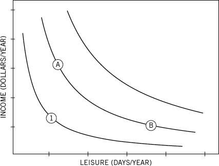

****************
 \ 
 
```{r prelim, echo = FALSE}

# general params
# ============================

# enable/disable manual page breaks
activate_manual_pb <- TRUE


# context-detection functions
# ============================

# getcontext returns the doc conversion context
# From Hadley's ggplot2 book:  Knowing conversion target 
is_latex <- function() {
        identical(knitr::opts_knit$get("rmarkdown.pandoc.to"), "latex")
}

# html same
is_html <- function() {
        identical(knitr::opts_knit$get("rmarkdown.pandoc.to"), "html")
}

getcontext <- function(){
        if (is_latex()) {"latex" 
                   } else if (is_html()) {
                           "html"
                   } else {"other"} 
}

# get the code chunk name (for captionning)
getchunkname <- function() {knitr::opts_current$get("label")}


# labelling and referencing functions
# ===================================

# Labelling principles: 
# ---------------------
# 
# * Plot captions: if captioning is enabled, all the plots should
# have a a caption.( default text = ""). In the caption
# there may be a label statement. otherwise, knitr/pandoc
# seems to do this automatically ==> label = fig:chunkname

# * we may do the same for tables; label = tab:chunkname

# * pictures must be labelled in the caption when included with 

# * header have headers Id: link with [text](#Id)
# 
# * Label arbitrary text with any label. 


# Referencing:
# ------------
# 
# * Prefixes: fig = figure 
#             tab = table
#             sec = section
#             no = nothing in particular
# 
# * In LaTex/PDF
# 
# ref(label)/pageref(label)
#            --> if figure, fig number / page number
#            ==> if table, tab number / page number
#            --> if section/heder header num / beginning pagenum
#            --> if arbitrary text section num / label pagenum
#                 ==> In each case we can have reference + link
# * In HTML
# ref(label)/pageref(label)
#            --> if figure, fig number / nothing
#            --> else nothing for now but a link to the object. 
#                The text of the link will be Table:label / Section:Label or Label  
# 
# Consequence: the arguments of general reference function refs:
# 
# refs(prefix, id , pageref = FALSE, capital = FALSE) 
#        ==> returning (LaTex) : figure/table/section # , page ## 
#                      (HTML) : figure # (ref + link)
#                               table/section label (link only)
# 

# Definitions for LaTex, extended to html:
# 
# name of object = xr

xr <- local({
        i <- 0
        ref <- list(default = "?xr?") # initializes ref = the reference list in HTML
        list(
                cap = function(prefix, id = getchunkname(), 
                               text = "", 
                               center=FALSE, col="black", 
                               inline=FALSE,
                               context = getcontext()) {
                        refName <- paste(prefix, id, sep = ":")
                        switch(context,
                               latex = paste0("\\label{", refName, "}",text),
                               html = { # sprintf('<a name="%s"></a>%s', refName, text )
                                       cap.html(refName = refName, text = text, 
                                                center=center, col=col, inline=inline)
                               },
                               other = text)
                },
                
                # auxiliary function: prepares one (partial) reference: 
                # main ref or pageref
                ref1 = function(prefix, id, page = FALSE, context =getcontext()){
                        refName <- paste(prefix, id, sep = ":")
                        switch(context,
                               latex = {lcommand <- ifelse(page,"pageref","ref")
                                        toprint <- paste0("\\", lcommand,"{", refName, "}")},
                               html = if (prefix == "fig") { # ref1 only for figures
                                       toprint <-paste0("<a href=\"#", 
                                              refName, "\">", ref[[refName]], "</a>")
                               }else{
                                       warning("No reference yet for non-figure objects")
                                       toprint <-"No reference yet for non-figure objects"
                               } , 
                               other = {
                                       warning("!!Ref attempt to unsupported object!!")
                                       toprint <- "!!Ref attempt to unsupported object!!"
                               })
                        toprint # return value
                },
                
                # reference function: main ref [+ pageref]
                refs = function(prefix, id, 
                                withpage = FALSE, capital = FALSE, 
                                context =getcontext()){
                        refName <- paste(prefix, id, sep = ":")
                        typeref <- switch(prefix,
                                          fig = if (capital) {"Figure"} else {"figure"} ,
                                          tab = if (capital) {"Table"} else {"table"},
                                          sec = if (capital) {"Section"} else {"section"},
                                          no = if (capital) {"Section"} else {"section"}
                        )
                        switch(context,
                               latex = {
                                       main <- paste(typeref, 
                                                     xr$ref1(prefix, id,  
                                                          page = FALSE, 
                                                          context = context),
                                                     sep = " ")
                                       result <- ifelse(withpage, 
                                                        paste0(main , ", ", "page ", 
                                                               xr$ref1(prefix, 
                                                                       id, 
                                                                       page = TRUE,
                                                             context = context)),
                                                        main)
                               },
                               html = {
                                       if (prefix == "fig") {
                                               result <- paste(typeref, 
                                                     xr$ref1(prefix, id, page = FALSE),
                                                     sep = " ")
                                       } else {# make a link
                                               result <- sprintf('[%s %s](#%s)', 
                                                       typeref, refName, refName )
                                       }
                               },
                               other = result <- sprintf('[%s %s](#%s)', 
                                               typeref, refName, refName ) )
                result #return value
                },
                
                # Functions for HTML
                # ==================
                
                cap.html = function(refName, text, 
                                    center=FALSE, col="black", inline=FALSE) {
                        i <<- i + 1
                        ref[[refName]] <<- i
                        css_ctr <- ""
                        # added
                        if (inline) {
                                if (center) {
                                        css_ctr <- 
                                                "text-align:center; display:inline-block;width:100%;"
                                        cap_txt <- paste0("<span style=\"color:", 
                                                          col, "; ", css_ctr, 
                                                          "\">Figure ", i, ": ", text , "</span>")
                                } 
                        }else {
                                cap_txt = text
                        }
                        
                        anchor <- paste0("<a name=\"", refName, "\"></a>")
                        if (inline) { paste0(anchor, cap_txt)    
                        } else {
                                # list(anchor=anchor, cap_txt=cap_txt) 
                                paste0("Figure ", i, ": ", anchor, cap_txt) # mod
                        }
                },
                
                
                # return all figure references for debugging
                ref_all <- function(){ 
                        ref
                }, 
                
                
                # pre-retrieving captions:
                # -----------------------
                
                # in html, read the figure captions and
                # collect references.  This function will
                # read through *this* Rmd file, and attempt
                # to extract all of the labels (not caption
                # text) used for Figure captions. These
                # labels are used as anchors, so scanning
                # through the document now will allow us to
                # create cross references before the
                # captions actually appears.
                read_fig_cap = function( 
                        rmdFn = knitr::current_input(),  # filename of input document
                        context=getcontext() ){
                        if (context != "latex") {
                                ## Read lines in doc and close connection
                                rmdCon <- file(rmdFn, open = "r")
                                rmdLines <- readLines(rmdCon)
                                close(rmdCon)
                                
                                # Pull out all occurences of at least one back tick,
                                # followed by any number of characters, followed by
                                # fig$cap (all on one line)
                                figscap_idx <- grep("`+(.*)fig\\$cap", rmdLines) 
                                # returns the indices of the lines that match the
                                # pattern.
                                # Keep only matching lines
                                rmdLines <- rmdLines[figscap_idx] 
                                
                                #Get rid of everything up until the start of the
                                #caption label. This presumes the caption label
                                #is the first argument of fig$cap() # E.g., fig.cap =
                                #fig$cap("my_label", ...)
                                rmdLinesSansPre <- 
                                        sub("(.*)fig\\$cap(.*?)[\"']", "", rmdLines)
                                
                                ## Identify everything up until the first quote
                                match_data <- regexpr("(.*?)[\"']", rmdLinesSansPre)
                                
                                # Reduce the length by one,because we're not
                                # interested in the final quote
                                attr(match_data, "match.length") <- 
                                        attr(match_data, "match.length") - 1
                                
                                ## Extract the labels
                                fig_labels <- 
                                        regmatches(rmdLinesSansPre, match_data, invert=FALSE)
                                
                                if (length(fig_labels) > 0) {
                                        
                                        # Test for duplicates
                                        if (anyDuplicated(fig_labels) > 0) {
                                                stop("Duplicate caption labels detected")}
                                        
                                        ## Create a named list of Figure numbers
                                        ref <<- as.list(1:length(fig_labels))
                                        names(ref) <- fig_labels
                                        
                                }
                        }
                } # end function read_fig_cap
                
        ) # end list
        
} ) # end local


#  helper functions
#  ================
centertext <- function(string, decoration = c("","*", "_" ,"**", "__" ), 
                 context = getcontext()){
        if (decoration == "*" || decoration == "_" ) {
                switch(context,
                       html = {db <- "<em>" ; fin <- "</em>"},
                       latex = {db <- "\\textit{" ; fin <- "}"},
                       other = {db <- "" ; fin <- ""} )
                
        } else if (decoration == "**" || decoration == "__"){
                switch(context,
                       html = {db <- "<strong>" ; fin <- "</strong>"},
                       latex = {db <- "\\textbf{" ; fin <- "}"},
                       other = {db <- "" ; fin <- ""} )
        } else {db <- "" ; fin <- "" }

string  <- paste0(db, string, fin)
         
string  <-  switch(context,
               html = paste0("<center>",string, "</center>"),
               latex = paste0("\\begin{center}", string,"\\end{center}"),
               other = string) 
string
}


# manual pagebreak
pagebreak <- function(string = "", active = activate_manual_pb, context = getcontext()){
        if (active) {
                switch(context,
                       html = paste0("",string, ""),
                       latex = paste0("\\clearpage", string),
                       other = string)         
        } else {""}
}        


```

```{r setup, include=FALSE}
knitr::opts_chunk$set(echo = TRUE, fig.width = 3, fig.height=2, fig.align = "center", fig.show = "hold", fig.pos = "H")
# knitr::opts_knit$set(kable.force.latex = TRUE) # try correcting overfloating tables
```


```{r libs}
library(ggplot2)
library(knitr)
library(pander)
library(xtable)
```


# Objective {#sec:obj}

Try the cross-referencing functions in LaTex and HTML

# Conclusions {#sec:conclusions}

* We must use captions. BUT, whenever we have captions, figures and tables will "float" on the pages, and it may be difficult to understand where.
    * for figures, 
        * use the Yaml header: `header-includes: "\\usepackage{float}" `
        * specify **in the default chunk options of knitr**: fig.pos = H , like that:
            * knitr::opts_chunk$set(echo = TRUE, fig.show = "hold", fig.pos = "H")
    * For tables : ?? we should replace `\begin{table}` with `\begin{table}[H]`. working on it ... But with figures fixed, tables seem more or less manageable. 

* Figures come in 2 flavours
    * plots, created by a code chunk in the text
        * do not need a "Label" in their captions, 
        * are crossreferencable, as soon as they have a caption option in the chunk.
    (i.e. fig.cap = "some text" creates the reference. The anchor name is the chunk name)
        * What if they are supplied a different name : the supplied label takes precedence
        * TODO: give captions to all figures. 
            + labels: We may use the automatic id = fig:chunkname, or assign a forced id with `\label` 
            + reference: use `\ref{id}` ==> returns the figure number.
            + page reference: use `\pagref{id}` ==> returns the figure pagenum.
    * images, retrieved from disk by a pandoc image link. 
        * TODO: Use: `{width=2.5in height=2in}`
    
* tables
    * Also work without explicit label (at least for kable and pander table): a plain text caption triggers numbering, but only the system knows their anchor, so ;
    * do need a label command in their captions
    * If a table is created without a caption, the table index is still incremented: if captions are enabled, it is better to systematically caption all tables. However what to do with manual tables? : assign manually a caption: on the line directly after the table, enter:
        * this: `Table: Here is your caption text \label{tab:id}`


* Arbitrary anchors in text:
    * We can put a `\label{id}` in a section's ordinary text.
        + When referred to by `\ref{id}` then it will point to the _section header_. (But no link is provided to the `\ref(id)`; unless we have `number-sections: yes` in the yaml header)
        + when referred to with `\pageref{id}`, it will return the _label's page_

* Section references: _we need **"number-sections: yes"** in the yaml header_. Yes using the header label (but for the link, use #label)
    * example: see section "[Referencing again after the creation](#refagain)", (link not-so-neccessary here, as we get it right now, but it also work when sections are not numbered) , i.e. section \ref{refagain}, beginning page \pageref{refagain}.


# Including / referencing  Plots and table examples {#sec:plottables}

You can embed and reference plots, tables and sections, plus arbitrary loci in the text.


## Referencing elements produced later in the document {#sec:refbefore}

Let us reference them before we create them: for example:

* We first have 
    * an uncaptioned kable table in chunk firsttbchunk: table \ref{tab:firsttbchunk}, or maybe \ref{tab:hehe} No, use id = "table.2" ==> Table table \ref{"table.2"}
    * an uncaptioned pander table in chunk firsttb2chunk: table \ref{tab:firsttb2chunk}    
    * an uncaptioned plot figure \ref{fig:firstchunk}, (chunk name as anchor) ==> id = V ==> fig:\ref{"figure.1"}

    * a text-captioned (without label) plot figure \ref{fig:secchunk}, (chunk name as anchor), and 
    * a text-captioned plot from an unnamed chunk : \ref{fig:unnamed-chunk-1} (chunk name as anchor)

* Regular captioned figures:
    * Figure \ref{fig:pressure} (using chunk name as anchor)
    * Figure \ref{fig:foo} or 
    * figure \ref{fig:fee}  and at last 
    * figure \ref{fig:faa}
* pictures (not generated by the document)
    * picture \ref{fig:pict}

* Referencing the tables : 
    * Table \ref{tab:firsttbchunk}, no but with the id "table.2" (this is table 2 - cf poem) table \ref{"table.2"}
    * Table \ref{tab:firsttb2chunk}, idem "table.3" table \ref{"table.3"}
    * table \ref{tab:mtcars}, 
    * table \ref{tab:cars}

* referencing section/subsection headers
    * Headers have an id defined by {#id} at the end of the header
    * header link: [more tables section](#sec:moretab) ==> links ok, using #id as a target
    * header id works with pageref : section [more tables section](#sec:moretab) is section \ref{sec:moretab} and begins on page \pageref{sec:moretab} ==> ok, use `\ref{id}`, not `\ref{id}` 
    * header ref with `secref` : `\secref{sec:moretab}`,==> also works, but not interesting ?
    * you can also put an arbitrary text reference at the beginning of te section, but it is unnecessary 
    
* referencing arbitrary text
    * text \ref{text:verse} link that takes the form of the section number ==> should be used to reference sections
    * Text again with secref: `\secref(text:verse)`
    * more text with a quote reference \ref{quote}, page \pageref{quote} 
    * try also the link form: [#sec:moretab](#sec:moretab), 
    * or [sec:moretab](sec:moretab) 
    * try again: with section header `create`: section \ref{create}, page \pageref{create}


## Creating Plots and tables {#sec:create}

`r xr$cap(prefix="no", id = "verse")`

This label(` (r) xr$cap(prefix="no", id = "verse")`) is in the text at the beginning of the section. It can be used in refs and points to the section. (not the verse) the reference would be programmatically `r xr$refs(prefix="no", id = "verse", withpage=TRUE)`. ==> manually sec: \ref{no:verse}, pg: \pageref{no:verse}. And without page ref (default prog) == `r xr$refs(prefix="no", id = "verse")`

`r pagebreak()`

|       Precise and Visual 
|       ------------------:
|          
|          The plot reigns supreme
|            In the ocean of stats
|  and brings secrets to the light
| hidden treasures, drowned jewels
|
|       But the table that exposes
|              facts to the reader
|    brings numbers in the picture
|             shows proof forcibly
|
|                          without 
|                          a doubt
Table: `r xr$cap("tab", "poem", 'A \"poem\" (?) as a table with a label' )`

Remark: with every the table,  the table index is increased by 1, even without caption

The above table is manually set up and had been assigned a label (tab:poem) the label can be referred to by `r xr$refs("tab", "poem", withpage = TRUE)`
- ref is ok, and pageref as well.


### Two tables and more plots {#sec:twotab}

With this first chunk, we produce table `r xr$refs(prefix="tab", id="firsttbchunk")`, then in the next `r xr$refs(prefix="tab", id="firsttb2chunk")`, and then  `r xr$refs(prefix="fig", id="firstchunk")`, which is on page `r xr$ref1(prefix="fig", id="firstchunk", page=TRUE)`

```{r firsttbchunk}
data("ToothGrowth")
kable(head(ToothGrowth), caption = xr$cap(prefix="tab", text = "hehe"))
```

```{r firsttb2chunk}
pander(head(faithful), caption = xr$cap(prefix="tab", text = "hoho"))
```

```{r firstchunk, fig.cap = "first plot"}
ggplot(ToothGrowth, aes(dose,len, color=supp))+ geom_jitter()
```


```{r secchunk, fig.cap="text capped figure from secchunk"}
ggplot(ToothGrowth, aes(dose,len, color = supp))+ geom_jitter() + facet_grid(. ~ supp)
```


```{r , fig.cap="text capped figure from unknown"}
ggplot(ToothGrowth, aes(dose,len, color = supp))+ geom_jitter() + facet_grid(supp ~ .)
```


```{r pressure, echo=FALSE, fig.cap = "hard-coded", fig.height=3}
# removed:"\\label{fig:foo}This is caption fig 0"
plot(pressure)
```

Note that the `echo = FALSE` parameter was added to the code chunk to prevent printing of the R code that generated the plot.

Here is a Picture (not a plot generated by the doc), labelled \ref{fig:pict}


{width=2.5in height=2in}


```{r foo, fig.cap = "caption fig 1"}
ggplot(mtcars, aes(wt, mpg))+ geom_point()
```


```{r fee, fig.cap = "\\label{fig:fee}This is caption fig 2" }
ggplot(mtcars, aes(cyl, mpg))+ geom_boxplot(aes(group=cyl))
```

Some more text to separate the items , 

This is a famous quote

"Prediction is difficult, especially about the future." Yogi Berra \label{quote}

What if we reference this ?
direct ref is \ref{quote}, page \pageref{quote}

Now, a last plot

```{r chunfkfaa, fig.cap = "\\label{fig:faa}This is caption fig 3"}
ggplot(mtcars, aes(disp, mpg))+ geom_point(aes(color=factor(cyl)))

```

### More Tables {#sec:moretab}

You can have tables like this:

```{r mtcars}
kable(head(mtcars[, 1:5]), 
      caption = "\\label{tab:mtcars}This is the 'mtcars' `kable` table (ie 1)")
      
```


Or another: 

```{r cars}
kable(summary(cars), 
      caption = "\\label{tab:cars}This is the 'cars' `kable` table (ie 2)")
```


And another (double table)

```{r xcars, results='asis', fig.pos="H"}
print(kable(list(summary(cars),summary(ToothGrowth)), 
      caption = "\\label{tab:xcars}This is the 'cars' `kable` double table (ie 3)"), 
     table.placement="H") # don't know if this really helps
```


## Referencing again after the creation: {#sec:refagain}


* We first have 
    * an uncaptioned kable table in chunk firsttbchunk: table \ref{tab:firsttbchunk}, or maybe \ref{tab:hehe}
    * an uncaptioned pander table in chunk firsttb2chunk: table \ref{tab:firsttb2chunk}    
    * an uncaptioned plot figure \ref{fig:firstchunk}, (chunk name as anchor)

    * a text-captioned (without label) plot figure \ref{fig:secchunk}, (chunk name as anchor), and 
    * a text-captioned plot from an unnamed chunk : \ref{fig:unnamed-chunk-1} (chunk name as anchor)

* Regular captioned figures:
    * Figure \ref{fig:pressure} (using chunk name as anchor)
    * Figure \ref{fig:foo} or 
    * figure \ref{fig:fee}  and at last 
    * figure \ref{fig:faa}
* pictures (not generated by the document)
    * picture \ref{fig:pict}

* Referencing the tables : 
    * Table \ref{tab:firsttbchunk},
    * Table \ref{tab:firsttb2chunk},
    * table \ref{tab:mtcars}, 
    * table \ref{tab:cars}

* referencing section/subsection headers
    * Headers have an id defined by {#id} at the end of the header
    * header link: [more tables section](#sec:moretab) ==> links ok, using #id as a target
    * header id works with pageref : section [more tables section](#sec:moretab) is section \ref{sec:moretab} and begins on page \pageref{sec:moretab} ==> ok, use `\ref{id}`, not `\ref{id}` 
    * header ref with `secref` : `\secref{sec:moretab}`,==> also works
    * you can also put an arbitrary text reference at the beginning of te section, but it is unnecessary 
    
* referencing arbitrary text
    * text \ref{text:verse} link that takes the form of the section number ==> should be used to reference sections
    * Text again with secref: `\secref(text:verse)`
    * more text with a quote reference \ref{quote}, page \pageref{quote} 
    * try also the link form: [#sec:moretab](#sec:moretab), 
    * or [sec:moretab](sec:moretab) 
    * try again: with section header `create`: section \ref{create}, page \pageref{create}


# Finally {#sec:end}

And some text to finish: \
`r centertext( "Goodbye", decoration = "*")`


